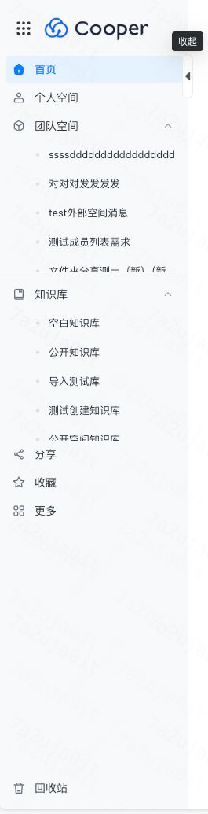
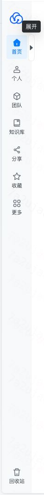
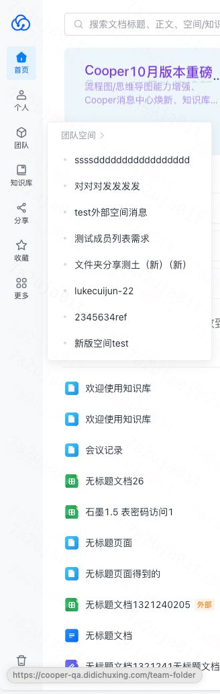
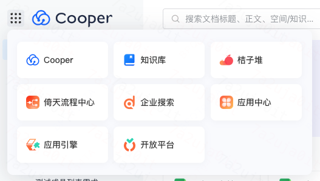
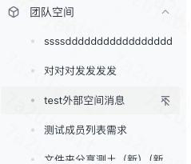

# 侧边栏交互测试清单

> 组件路径: `src/components/LayoutCooper/Aside`  
> 测试页面: `http://localhost:4001/`

---

## 设计稿参考

````carousel

<!-- slide -->

<!-- slide -->

<!-- slide -->

````

---

## 一、UI 测试（像素级对比）

### 1.1 Logo 区域
| 元素 | 检查项 |
|------|--------|
| Logo 图片 | 尺寸、清晰度、位置居左 |

### 1.2 IPortal（九宫格导航）

> ⚠️ Small 模式下隐藏

| 元素 | 检查项 |
|------|--------|
| 九宫格图标 | 尺寸、位于 Logo 左侧 |
| 弹窗面板 | 宽度、圆角、阴影、背景色 |
| 导航卡片 | 3 列布局，8 个入口 |



### 1.3 侧边栏展开/收起按钮
| 模式 | 检查项 |
|------|--------|
| 通用 | Hover 侧边栏时出现展开/收起按钮 |
| Large | 侧边栏宽度、导航项横向排列（图标 + 文字） |
| Small | 侧边栏窄、导航项纵向排列（图标 + 文字上下） |

### 1.4 标准导航项（首页、个人空间、分享、收藏）
| 模式 | 检查项 |
|------|--------|
| Large | 图标 18px、文字与图标间距 12px、行高 34px |
| Small | 图标 + 文字纵向居中 |
| 默认态 | 文字 `@blueGray-1`、图标 `@blueGray-15`、背景透明 |
| 激活态 | 文字 `@primary-color`、背景 `@primary-1`、字重 500 |

### 1.5 可折叠项（团队空间、知识库）
| 模式 | 检查项 |
|------|--------|
| Large | 图标、文字、折叠按钮对齐 |
| Small | 图标 + 文字纵向排列 |
| 折叠按钮 | 20x20px、圆角 4px、图标 12px |
| 分割线 | 团队空间下方，高度 1px、颜色 `@blueGray-16` |

### 1.6 Small 模式弹层（团队空间、知识库）
| 元素 | 检查项 |
|------|--------|
| 弹层位置 | 出现在导航项右侧 |
| 弹层标题 | 显示"团队空间 >"或"知识库 >" |
| 弹层样式 | 宽度、圆角、阴影 |
| 子列表项 | 样式与 Large 模式一致 |

### 1.7 子列表项
| 元素 | 检查项 |
|------|--------|
| 圆点标识 | 前方有圆点 |
| 文字超长 | 省略号显示 |
| Hover 背景色 | 背景高亮 |
| Hover 置顶按钮 | 右侧出现置顶/取消置顶按钮 |



### 1.8 更多系统
| 元素 | 检查项 |
|------|--------|
| 图标文字 | `dk-icon-gengduoxitong`、"更多" |
| Hover 弹层 | 宽度、圆角、阴影、背景色 |

### 1.9 回收站
| 元素 | 检查项 |
|------|--------|
| 位置 | 固定在底部、与内容区分离 |

---

## 二、功能测试（交互行为）

### 2.1 Logo
| 交互 | 预期行为 | 测试步骤 |
|------|----------|----------|
| 点击 | 跳转 `/` | 1. 点击 Logo<br>2. 验证 URL |
| Hover | 鼠标手型 | 1. 悬停 Logo<br>2. 观察鼠标样式 |

### 2.2 IPortal（九宫格导航）

> ⚠️ Small 模式下隐藏，无需测试

| 交互 | 预期行为 | 测试步骤 |
|------|----------|----------|
| Hover | 背景变灰色 | 1. 悬停九宫格图标<br>2. 观察背景变化 |
| 点击 | 弹出导航弹窗（8 个入口） | 1. 点击九宫格<br>2. 验证弹窗显示 |
| 弹窗外点击 | 弹窗关闭 | 1. 点击弹窗外部<br>2. 验证弹窗消失 |

### 2.3 侧边栏展开/收起
| 交互 | 预期行为 | 测试步骤 |
|------|----------|----------|
| Hover 侧边栏 | 出现展开/收起按钮 | 1. 悬停侧边栏边缘<br>2. 观察按钮出现 |
| 点击按钮 | 切换 Large/Small 模式 | 1. 点击按钮<br>2. 验证模式切换 |
| 状态持久化 | 刷新页面保持模式 | 1. 切换模式<br>2. 刷新页面<br>3. 验证模式保持 |

### 2.4 标准导航项
| 交互 | 预期行为 | 测试步骤 |
|------|----------|----------|
| Hover | 背景 `@blueGray-16` | 1. 悬停元素<br>2. 观察背景变化 |
| 点击 | 跳转对应路由 + 激活态 | 1. 点击元素<br>2. 验证 URL 和激活样式 |
| 激活态 Hover | 背景保持 `@primary-1` | 1. 在激活态元素上悬停<br>2. 验证背景不变 |
| Small Hover | 显示 Tooltip | 1. Small 模式悬停元素<br>2. 观察 Tooltip |

**路由映射：**
| 导航项 | 路由 |
|--------|------|
| 首页 | `/` |
| 个人空间 | `/disk` |
| 分享 | `/tome` |
| 收藏 | `/favorite` |

### 2.5 可折叠项（团队空间、知识库）

**Large 模式：**
| 交互 | 预期行为 | 测试步骤 |
|------|----------|----------|
| 行 Hover | 背景 `@blueGray-16` | 1. 悬停元素<br>2. 观察背景变化 |
| 行点击 | 跳转对应列表页 | 1. 点击文字区域<br>2. 验证路由跳转 |
| 折叠按钮 Hover | 背景 `@blueGray-17` + Tooltip | 1. 悬停折叠图标<br>2. 观察按钮背景和 Tooltip |
| 折叠按钮点击 | 子列表展开/收起 | 1. 点击折叠图标<br>2. 验证子列表显示/隐藏 |
| 状态持久化 | 刷新页面保持展开状态 | 1. 收起知识库<br>2. 刷新页面<br>3. 验证知识库仍为收起状态 |

**Small 模式：**
| 交互 | 预期行为 | 测试步骤 |
|------|----------|----------|
| Hover | 弹出子列表弹层 | 1. 悬停团队空间<br>2. 验证弹层出现 |
| 弹层标题点击 | 跳转列表页 | 1. 点击"团队空间 >"<br>2. 验证跳转 `/team-folder` |
| 弹层子项点击 | 跳转详情页 | 1. 点击某个团队<br>2. 验证跳转详情页 |
| 鼠标移出弹层 | 弹层关闭 | 1. 鼠标移出弹层区域<br>2. 验证弹层消失 |

**路由映射：**
| 导航项 | 路由 |
|--------|------|
| 团队空间 | `/team-folder` |
| 知识库 | `/knowledge/mine` |

### 2.6 子列表项
| 交互 | 预期行为 | 测试步骤 |
|------|----------|----------|
| Hover | 背景高亮 + 右侧出现置顶按钮 | 1. 悬停子项<br>2. 观察背景变化和右侧按钮 |
| 点击 | 跳转详情页 | 1. 点击某个团队空间<br>2. 验证 URL 包含对应 ID |
| 文字超长 | 省略号 + Hover Tooltip | 1. 悬停长名称子项<br>2. 观察 Tooltip |
| 点击置顶按钮 | toggle 置顶状态 | 1. 点击置顶按钮<br>2. 验证图标切换 |
| 知识库置顶同步 | `/knowledge/mine` 数据更新 | 1. 在侧边栏置顶某知识库<br>2. 访问 `/knowledge/mine`<br>3. 验证置顶状态 |
| 团队空间置顶同步 | `/team-folder` 数据更新 | 1. 在侧边栏置顶某团队空间<br>2. 访问 `/team-folder`<br>3. 验证置顶状态 |

### 2.7 更多系统
| 交互 | 预期行为 | 测试步骤 |
|------|----------|----------|
| Hover | 弹出系统列表弹层 | 1. 悬停"更多"<br>2. 验证弹层显示 |
| 弹层内容 | 正确显示系统列表 | 1. 检查弹层内各系统入口 |

### 2.8 回收站
| 交互 | 预期行为 | 测试步骤 |
|------|----------|----------|
| Hover | 背景 `@blueGray-16` | 1. 悬停回收站<br>2. 观察背景变化 |
| 点击 | 跳转回收站页面 | 1. 点击回收站<br>2. 验证 URL |

**回收站路由（租户判断）：**
| 租户类型 | 路由 | 判断方式 |
|----------|------|----------|
| DiDi 内部租户 | `/recycle/myspace` | `isDiDiTenant() === true` |
| 外部租户 | `/recycle/teamspace` | `IsExternalTenant === true` |

> 可通过 `store.getState().GlobalData.IsExternalTenant` 判断租户类型。

---

## 三、边界场景测试

| 场景 | 测试步骤 | 预期结果 |
|------|----------|----------|
| 无团队空间数据 | 清空团队空间数据 | Large: 不显示折叠按钮<br>Small: 弹层为空 |
| 无知识库数据 | 清空知识库数据 | Large: 不显示折叠按钮<br>Small: 弹层为空 |
| 子列表滚动 | 添加大量团队空间 | 列表区域可滚动，滚动条为自定义样式 |

---

## 四、样式变量参考

| 变量名 | 用途 |
|--------|------|
| `@blueGray-1` | 默认文字颜色 |
| `@blueGray-15` | 默认图标颜色 |
| `@blueGray-16` | Hover 背景色 |
| `@blueGray-17` | 折叠按钮 Hover 背景 |
| `@primary-color` | 激活态主色 |
| `@primary-1` | 激活态背景色 |
| `@border-radius-sm` | 圆角值 |
